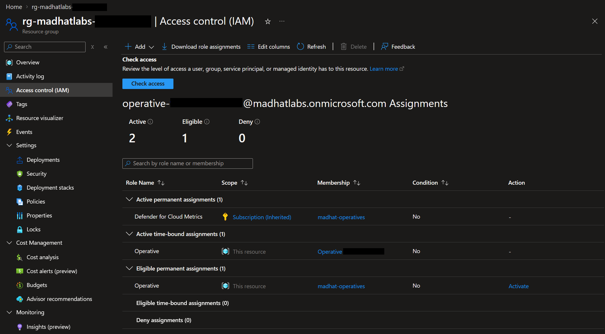
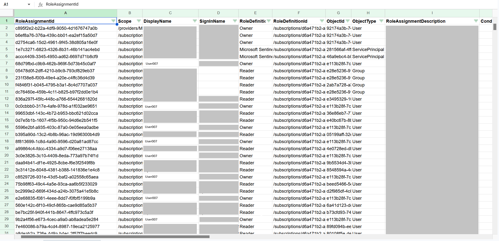
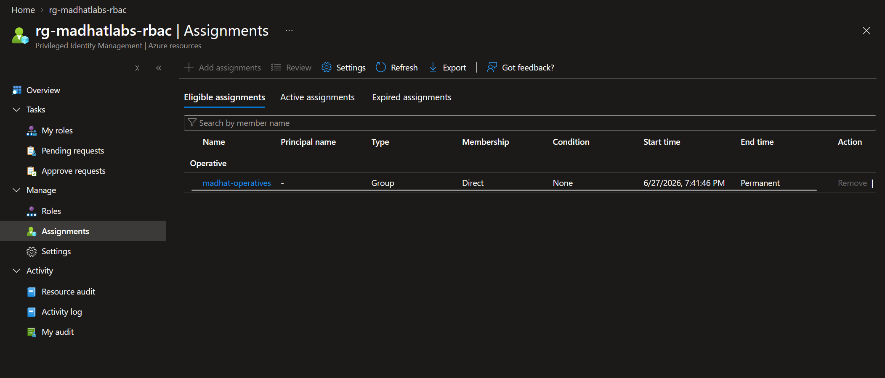

# The Privilege Audit

## Scenario
After a recent security incident, the management board is asking for a fresh report of who can do what in the Azure environment. My job is to an IAM audit and document the methods and findings.

## Environment
Live multi-user Azure training tenant, Reader access. Lab answers and other tenant sensititive data may be scrubbed.

## Audit Methodology Comparison
| Method | Catches | Misses |
| :----- | :------ | :----- |
| **IAM blade / export**   | Active assignments at scope<br> Inherited permissions | Group membership<br> Orphaned principals |
| **Azure CLI**            | Active assignments at scope<br> Inherited permissions<br> Orphaned principals | Tenant-wide visibility in a single execution (scope-limited per run) |
| **Azure Resource Graph (KQL)** | Tenant-wide audit in one query | PIM eligible assignments |
| **PIM export**           | Eligible vs active<br> Activation history | Permanent assignments outside PIM |

## Audit Method 1 - Access Control (IAM) Blade
The Azure Portal's IAM blade serves as a quick starting point for assessing role-based access. While useful for a high-level overview, it comes with notable visibility gaps. Although it displays assigned security groups, it does not natively resolve group memberships. This creates a blind spot where actual effective permissions can be easily overlooked, particularly with dynamic groups where membership changes automatically. The IAM blade also does not show orphaned permissions (assignments left behind after a principal has been deleted).  

>**Finding:** Excessive permissions (**Severity: HIGH**)  
>User **User007** has standing owner role on an excessive amount of resources. Owner role is usually overly permissive compared to what the user actually requires for their job function.
>
>**Recommendation:** Remove standing owner role, review what permissions the user actually needs (following least privilege), implement PIM so that User007 has to activate the role for a specified duration and requre MFA and/or approval.


*screenshot03-01 shows the IAM blade of a resource group. Here you see active and eligible assignments.*


*screenshot03-02 demonstrates the csv export of a Subscription finding excessive owener permissions of many Resources in the Subscription.*

## Audit Method 2 - Azure CLI
Azure CLI introduces scriptable, repeatable, and programmatic capabilities to the audit process. Transitioning from manual portal checks to command-line tooling allows an analyst to turn a one-time audit into an automated, scheduled check. A benefit of Azure CLI is that it exposes orphaned permissions.  
  
>**Finding:** Orphaned permission (**Severity: MEDIUM**)  
>Resource group **rg-madhatlabs-abcdefg-123** has an orphaned permission. The user account no longer exists, but the permission is still there.
>
>**Recommendation:** Run the Azure CLI command `az role assignment delete --assignee "11111111-2222-3333-4444-555555555555" --role "Reader" --resource-group "rg-madhatlabs-abcdefg-123"` to delete the orphaned permission.

*Below is a sample of scrubbed output of Azure CLI command* `az role assignment list --resource-groups "rg-madhatlabs-abcdefg-123"` *demonstrating an orphaned permission. See the principalName field is null.*
```
    {
    "createdBy": "d472c81a-9f33-4b1e-8219-5a8e0f6c234b",
    "createdOn": "2026-07-30T16:56:59.341139+00:00",
    "description": "",
    "id": "/subscriptions/12345678-1234-1234-1234-123456789abc/resourceGroups/rg-madhatlabs-abcdefg-123/providers/Microsoft.Authorization/roleAssignments/87654321-4321-4321-4321-210987654321",
    "name": "87654321-4321-4321-4321-210987654321",
    "principalId": "11111111-2222-3333-4444-555555555555",
    "principalName": "",
    "principalType": "User",
    "resourceGroup": "rg-madhatlabs-abcdefg-123",
    "roleDefinitionId": "/subscriptions/12345678-1234-1234-1234-123456789abc/providers/Microsoft.Authorization/roleDefinitions/b24988ac-6180-42a0-ab88-20f7382dd24c",
    "roleDefinitionName": "Reader",
    "scope": "/subscriptions/12345678-1234-1234-1234-123456789abc/resourceGroups/rg-madhatlabs-abcdefg-123",
    "type": "Microsoft.Authorization/roleAssignments",
    "updatedBy": "d472c81a-9f33-4b1e-8219-5a8e0f6c234b",
    "updatedOn": "2026-07-30T16:56:59.341139+00:00"
  }
```

## Audit Method 3 - KQL (Kusto Query Language)
KQL is a powerful read-only query language used with the Microsoft security stack. Leveraging KQL through Azure Resource Graph (ARG) can shift the audit from a single scope check to a powerful, tenant wide operation. Remember the orphaned permission we found in Azure CLI? With KQL we can scan that principal id for more orphaned permissions.  
  
>**Finding:** None (**Severity: N/A**)  
>Principal ID **11111111-2222-3333-4444-555555555555** has no additional orphaned permissions.

*Below is an example of a query that will check the tenant and find any additional orphaned permissions for that specific principalId.*

```
authorizationresources
| where type =~ 'microsoft.authorization/roleassignments'
| extend principalId = tostring(properties.principalId)
| extend description = properties.description
| where principalId == '11111111-2222-3333-4444-555555555555'
| project name, principalId, principalType = properties.principalType, scope = properties.scope, description
```

## Audit Method 4 - PIM (Privileged Identity Management)
Privileged Identity Management governs Just-In-Time (JIT) access, splitting administrative exposure between eligible assignments and active assignments. Reviewing PIM allows exporting CSV or JSON to find eligible and active assignments. From a risk perspective, this step is critical: an eligible assignment without strict guardrails (such as required MFA, maximum duration limits, or mandatory approval workflows) can effectively function as a permanent backdoor if an attacker compromises an eligible user's account.  

>**Finding:** Group Eligibility (**Severity: Low**)  
>Group **madhat-operatives** has an eligible assignment.
>
>**Recommendation:** Review members of group **madhat-operatives**.


*screenshot03-03 shows PIM blade where you can view eligible assignments waiting to be activated.*

## Additional Resources
https://learn.microsoft.com/en-us/azure/role-based-access-control/role-assignments-list-cli  
https://learn.microsoft.com/en-us/azure/governance/resource-graph/concepts/query-language  
https://learn.microsoft.com/en-us/entra/id-governance/privileged-identity-management/pim-resource-roles-assign-roles  
